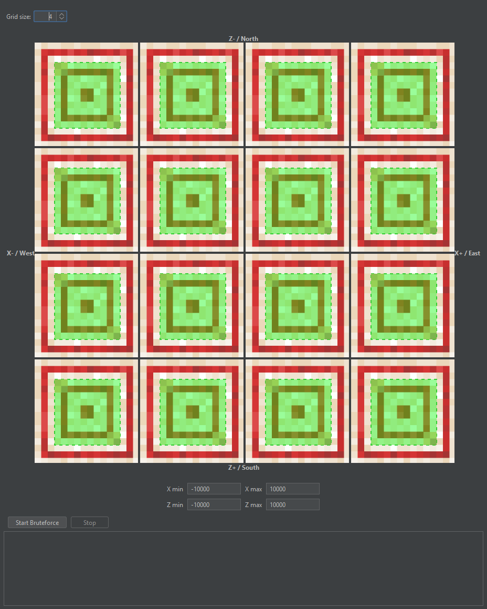

# Bamboo Locator
## What is this?
This is a tool that lets you input bamboo positions within a region, and find where in the world it could be.
This works for any seed since bamboo placement and flower offsets within a block are not dependent on the seed.

## What blocks does it work with?
I made this app with bamboo in mind since it's the easiest one to measure visually, but this also works with:

- mangrove_propagule
- tall_seagrass
- dandelion
- torchflower
- poppy
- blue_orchid
- allium
- azure_bluet
- red_tulip
- orange_tulip
- white_tulip
- pink_tulip
- oxeye_daisy
- cornflower
- wither_rose
- lily_of_the_valley
- sunflower
- lilac
- rose_bush
- peony
- tall_grass
- large_fern
- pitcher_plant
- bamboo_sapling
- bamboo
- warped_roots
- nether_sprouts
- crimson_roots
- pointed_dripstone (However, instead of the offset ranging from -0.25, 0.25, its -0.125, 0.125).
- hanging_roots
- short_grass (Also a random offset vertically of 0.2)
- fern (Also a random offset vertically of 0.2)
- small_dripleaf (Also a random offset vertically of 0.2)

## How to use?
Input the offsets you want for the bamboo in any grid size you want. the region made by the two bamboo in each block corresponds to the "allowed" bamboo spots. This can be useful for when you are not 100% sure of the position of it or if you only care on one axis of the bamboo.
Note that this is a top-down view, where the top is north. Generally, I have seen that having at least 5 exact bamboo inputs is enough to find where it is within a region of around 500,000x500,000.

